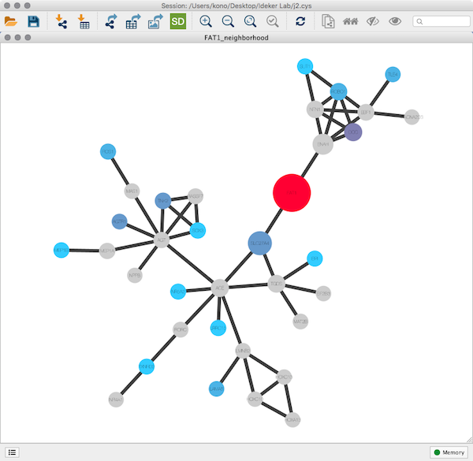
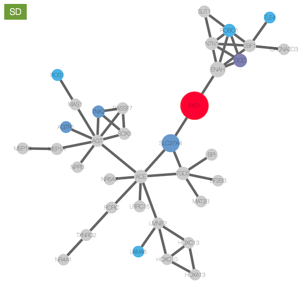
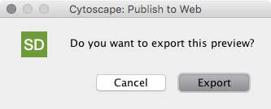

# Science Direct App for Cytoscape

##### A Cytoscape App for web-based publications

## Introduction
Cytoscape has a function to export network views and [Visual Styles](http://wiki.cytoscape.org/Cytoscape_User_Manual/Visual_Styles) as JSON files and they can be rendered with [Cytoscape.js](http://js.cytoscape.org/) network visualization library.  [ScienceDirect](https://www.elsevier.com/books-and-journals/content-innovation/interactive-network-viewer) journal supports interactive network visualization widget and you can use this app to generate data files for the journal article.

## Basic Functions
This application has two core functions: preview and export.

#### Preview

Original network view:

Preview in web browser:

You can preview your Cytoscape networks in your web browser before exporting it to files.  You can tweak your visualizations by comparing your original Cytoscape session and this preview. 

#### Export as zip archive

To visualize Cytoscape networks in web applications, you need network view JSON and Style JSON files. With this app, you can create zipped archive containing both files with one click.

## How to Use

1. Install latest version of this app from [App Store](http://apps.cytoscape.org/apps/sciencedirect).
1. Create camera-ready network visualization
1. Click  icon
1. Cytoscape opens new web browser window and displays your network
1. Pan / Zoom in the beowser window to check details
1. If the preview looks OK, click ___Export___ to specify file name
1. Click ___OK___

Now the zipped archive is ready for submission. 

## Limitations
Although most of the basic Visual Properties are translated into Cytoscape.js compatible, CSS-based styles, Cytoscape and Cytoscape.js are completely different applications using different rendering engines. Because of this, there are some incompatibilities between those two.  Some of the Visual Properties are not supported in Cytoscape.js and Styles using those unsupported properties will be ignored.  Complete list of Visual Property compatibility is available here:

* [Cytoscape &larr; &rarr; Cytoscape.js Visual Style Compatibility List](https://docs.google.com/spreadsheets/d/1iTDKGjro1-L7HGz1ftozqDKRxjQVSPF28jQLt7XGrSg/edit?usp=sharing)

### Major Incompatibilities
The following are known major incompatibilities.  Some of them will be supported in future versions.

* __Chart / Custom Graphics on nodes__
* Visual Property Bypass

## Bug Report
If you find bugs, please send them from [GitHub Issues](https://github.com/idekerlab/science-direct-app/issues).

## License
* Source Code: [The MIT license](http://opensource.org/licenses/MIT)
* Documentation: [CC BY-SA 4.0](http://creativecommons.org/licenses/by-sa/4.0/)

----
&copy; 2016 [Cytoscape Consortium](http://www.cytoscape.org/)  
Developed and maintained by [Keiichiro Ono](http://keiono.github.io/) ([UCSD Trey Ideker Lab](http://idekerlab.ucsd.edu/Pages/default.aspx))
